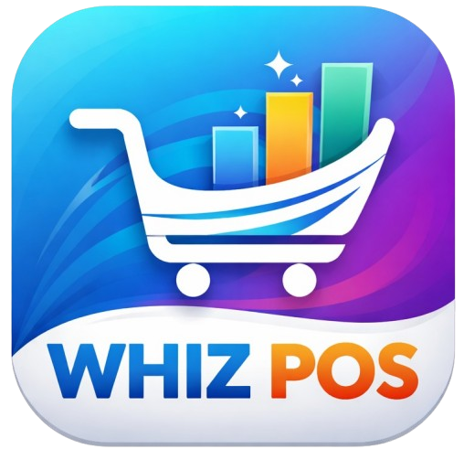

# <div align="center">



# WHIZ POS

### Enterprise-Grade Multi-Outlet Point of Sale System

Build, manage, and scale retail operations across unlimited outlets with real-time synchronization, offline-first reliability, intelligent outlet discovery, inventory management, and advanced business analytics.

<p align="center">

<a href="https://github.com/mburuwhiz/Whiz_POS_multioutlets/stargazers">

</a>

<a href="https://github.com/mburuwhiz/Whiz_POS_multioutlets/network/members">

</a>

<a href="https://github.com/mburuwhiz/Whiz_POS_multioutlets/issues">

</a>

<a href="./LICENSE">

</a>

</p>

<p align="center">

🚀 Real-Time Sync   •  
🌐 Offline First   •  
🏪 Multi-Outlet   •  
📡 Auto Discovery   •  
📦 Smart Inventory   •  
📊 Analytics

</p>

<p align="center">
<b>The modern POS infrastructure built for ambitious businesses.</b>
</p>

</div>

---

## ✨ Overview

WHIZ POS is a modern, enterprise-grade Point of Sale ecosystem designed for businesses operating across multiple stores, branches, warehouses, and retail locations.

Unlike traditional POS systems that struggle with synchronization and scalability, WHIZ POS provides a centralized management platform with distributed outlet operations, ensuring every branch remains connected, synchronized, and productive.

Whether you're running a supermarket chain, pharmacy network, restaurant franchise, hardware store, or wholesale distribution business, WHIZ POS keeps everything under one intelligent platform.

---

## 📸 Preview

> Add screenshots to make your repository significantly more attractive.

### Dashboard


### Point of Sale


### Inventory Management


### Analytics & Reports


---

## 🔥 Why WHIZ POS?

### 🏪 Multi-Outlet Architecture

Manage unlimited outlets from a single centralized server while maintaining independent outlet operations.

### 🌐 Offline-First Reliability

Sales never stop because of connectivity issues.

Outlets continue operating independently and automatically synchronize when the connection is restored.

### 🔄 Real-Time Synchronization

Inventory, products, users, and sales remain synchronized across every connected outlet.

### 📡 Intelligent Auto Discovery

Outlets automatically discover available servers through mDNS technology.

No manual IP configuration.

No complex networking setup.

### 📈 Built for Growth

Scale from one store to hundreds of locations without changing your operational workflow.

---

## 🚀 Core Features

| Feature                       | Description                                   |
| ----------------------------- | --------------------------------------------- |
| 🏪 Multi-Outlet Management    | Connect unlimited outlets to a central server |
| 🔄 Real-Time Synchronization  | Instant updates across all branches           |
| 🌐 Offline-First Operation    | Continue selling without network connectivity |
| 📡 Automatic Server Discovery | Seamless outlet connection using mDNS         |
| 📦 Inventory Management       | Product tracking and stock control            |
| 💳 Sales Processing           | Fast and intuitive checkout workflow          |
| 👥 User Roles & Permissions   | Admin, Manager, and Cashier access control    |
| 🧾 Receipt Printing           | Thermal printer support                       |
| 📊 Reports & Analytics        | Business intelligence dashboards              |
| 💰 Credit Customer Management | Customer balances and repayments              |
| 🔐 Secure Authentication      | Protected business operations                 |
| ⚡ Desktop Native Experience   | Electron-powered application                  |

---

## 🏗️ System Architecture

```text
                     ┌──────────────────────┐
                     │    MAIN SERVER       │
                     │──────────────────────│
                     │ Products             │
                     │ Inventory            │
                     │ Users                │
                     │ Sales                │
                     │ Reports              │
                     └──────────┬───────────┘
                                │
      ┌─────────────────────────┼─────────────────────────┐
      │                         │                         │
      ▼                         ▼                         ▼

┌──────────────┐        ┌──────────────┐        ┌──────────────┐
│   OUTLET A   │        │   OUTLET B   │        │   OUTLET C   │
│              │        │              │        │              │
│ POS Sales    │        │ POS Sales    │        │ POS Sales    │
│ Inventory    │        │ Inventory    │        │ Inventory    │
└──────────────┘        └──────────────┘        └──────────────┘

       ▲                       ▲                       ▲
       └──────── Synchronization Engine ──────────────┘
```

---

## 🛠 Technology Stack

| Layer              | Technology         |
| ------------------ | ------------------ |
| Frontend           | React 19           |
| Desktop Runtime    | Electron           |
| Language           | TypeScript         |
| Styling            | Tailwind CSS       |
| Build Tool         | Vite               |
| State Management   | Zustand            |
| Backend            | Express            |
| Icons              | Lucide             |
| Discovery Protocol | mDNS               |
| Synchronization    | Custom Sync Engine |

---

## 📂 Project Structure

```text
Whiz_POS_multioutlets/
│
├── assets/
│   ├── logo.png
│   ├── dashboard.png
│   ├── pos-screen.png
│   ├── inventory.png
│   └── reports.png
│
├── src/
│   ├── components/
│   ├── pages/
│   ├── store/
│   ├── lib/
│   ├── sync/
│   └── main/
│
├── electron.cjs
├── preload.js
├── vite.config.ts
├── tailwind.config.ts
├── tsconfig.json
└── package.json
```

---

## ⚡ Quick Start

### Clone Repository

```bash
git clone https://github.com/mburuwhiz/Whiz_POS_multioutlets.git
cd Whiz_POS_multioutlets
```

### Install Dependencies

```bash
npm install
```

### Run Main Server

```bash
npm run dev:server
```

### Run Outlet

```bash
npm run dev:outlet
```

### Run Vite Development Server

```bash
npm run dev:vite
```

---

## 🖥 Production Build

Build production-ready installers:

```bash
npm run build
```

Generated files will be available in:

```text
dist/
```

---

## 📋 Typical Workflow

### Server Setup

1. Launch the server application
2. Complete initial configuration
3. Add products
4. Add users
5. Configure outlets
6. Start accepting connections

### Outlet Setup

1. Launch outlet application
2. Automatic server discovery begins
3. Send connection request
4. Wait for approval
5. Receive assigned products and users
6. Start processing sales

---

## 🎯 Perfect For

* Supermarkets
* Retail Chains
* Pharmacies
* Restaurants
* Hardware Stores
* Electronics Shops
* Fashion Stores
* Franchise Networks
* Wholesale Distribution Businesses
* Multi-Branch Enterprises

---

## 🗺 Roadmap

### Completed

* [x] Multi-Outlet Architecture
* [x] Real-Time Synchronization
* [x] Offline-First Support
* [x] Inventory Management
* [x] Credit Customer Tracking
* [x] Role-Based Permissions
* [x] Automatic Server Discovery
* [x] Receipt Printing

### Upcoming

* [ ] Mobile Companion App
* [ ] Cloud Synchronization
* [ ] Multi-Warehouse Support
* [ ] Supplier Management
* [ ] Barcode Management
* [ ] AI Sales Insights
* [ ] Automated Backups
* [ ] Advanced Forecasting

---

## 🤝 Contributing

Contributions are welcome.

If you have ideas, improvements, bug fixes, or feature requests:

1. Fork the repository
2. Create your feature branch
3. Commit your changes
4. Push your branch
5. Open a Pull Request

---

## 🐛 Reporting Issues

Found a bug?

Please create an issue:

https://github.com/mburuwhiz/Whiz_POS_multioutlets/issues

---

## ⭐ Support The Project

If WHIZ POS helps your business or development workflow, consider giving the repository a star.

It helps the project grow and reach more businesses.

---

## 📄 License

Distributed under the MIT License.

See the LICENSE file for more information.

---

## 👨‍💻 Author

### Whizpoint Solutions

Building modern business software for the next generation of retail.

---

<div align="center">

## WHIZ POS

### Modern Retail Infrastructure

Built with ❤️ by Whizpoint Solutions

⭐ Star the repository if you find it useful


</div>
